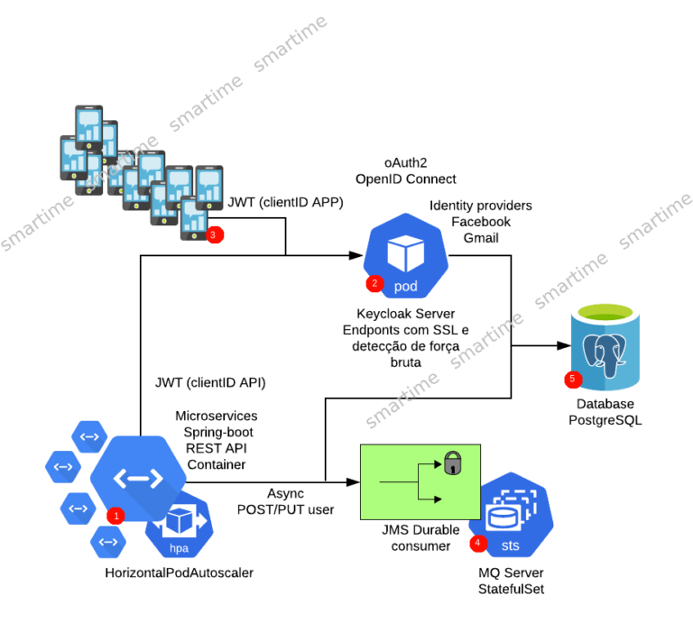

Uma das soluções de login mais conhecidas no mundo de APPs é o  Firebase. Mas o que é Firebase? A solução MBaaS (Mobile As a Service).  Ótima opção para uma infraestrutura de APP que inclui serviço de  login/SSO (Single Sign On), base de dados, analise de dados, cloud  messaging, AdMob, entre outros.

Em uma breve explicação, irei demonstrar vantagens e desvantagens de se utilizar o Firebase.

Vantagens

- Estrutura Pronta;
- Rápida Implementação;
- Segurança;
- Múltiplas Ferramentas;
- Facilmente Escalável.

Desvantagens

- Controle e Acesso;
- Limitação da Plataforma;
- Documentação;
- Performance;
- Pode fechar a qualquer momento.

Pensando em uma solução disruptiva. Iniciaremos uma série de posts descrevendo  desde arquitetura, até uma visão de baixo nível da solução. O processo  de utilização de sistemas distribuídos como alternativa de arquitetura  de solução. Através de softwares open-source com comunidade ativa. O que simplifica dificuldades técnicas e documentação. Uma vez que os  produtos estão sempre sendo atualizados.

Toda a solução prevê  utilização de cloud computing e com nível de orquestração de conteiners  de forma adequada. Cada vez mais aplicações modernas distribuídas  necessitam de escalonamento e distribuição de cargas. Tornando o  acompanhamento das necessidades de consumo de recursos realmente a  altura da sua demanda. Sem interferencias manuais. A cultura devOps é  imprescindível.

A utilização de cloud computing como AWS, Digital  Ocean, GCP, Heroku ou qualquer outro de sua escolha. Totalmente possível a sua aplicação. Independente da empresa escolhida. Uma das maiores  vantagens de não depender exclusivamente de um fornecedor deste serviço.

FrontEnd

A tecnologia escolhida para a solução é o React Native. Um dos frameworks mais utilizados atualmente.

BackEnd

Estou utilizando Java/Spring-boot para o backend. A construção de APIs  utilizando Apache camel torna a produtividade muito alta. Mesmo  utilizando banco de dados relacional.

Descrição da arquitetura

1. Microserviço em Spring-boot utilizando apache camel. Rotas REST com operações  RESTful utilizando serviço de mensageiria MQ (Apache), tornando possível um serviço assíncrono em suas filas. A aplicação é protegida com spring security e OAuth2. Pensando em escala, a aplicação é orquestrada em  container, assim como toda solução. Uso de HPA (Horizontal Pod  Autoscaler) determinado em testes de carga.
2. O uso dos serviços  REST bem como do login de usuário é realizado com o servidor de SSO  (Single Sign On) Keycloak. Configurado com o protocolo de autenticação  OAuth2 e camada adicional de segurança OpenID Connect.
3. O cliente (APP) para o projeto é uma aplicação de alto desempenho escrita em  framework open source React Native com versões em Android e IOS.  Protegidos com servidor de login do Keycloak descrito no item 2.
4. Serviço de mensageiria em Apache MQ. Criadas filas de mensagens de acordo com  os serviços de cadastro e operações de alto custo computacional.  Tornando possível o uso de serviços de forma assíncrona. Deploy em cloud computing em estratégia de STS ( StatefulSet).
5. Banco de dados relacional PostGreSQL em open source disponível em cloud (Database As a service).